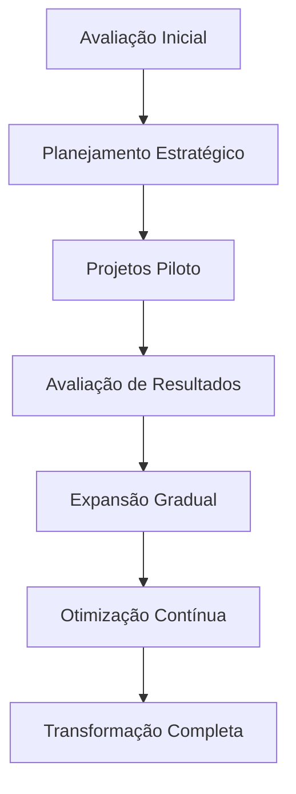

# Transformação Digital: Estratégias para o Sucesso Empresarial

A transformação digital não é apenas uma tendência - é uma necessidade para empresas que querem se manter competitivas no mercado atual. Neste artigo, vamos explorar estratégias práticas para implementar uma transformação digital bem-sucedida.

## O que é Transformação Digital?

A transformação digital é o processo de integração de tecnologias digitais em todas as áreas de um negócio, resultando em mudanças fundamentais na forma como a empresa opera e entrega valor aos clientes.

### Pilares da Transformação Digital

A transformação digital se baseia em quatro pilares fundamentais:

1. **Tecnologia**: Infraestrutura e ferramentas digitais
2. **Processos**: Otimização e automação de workflows
3. **Pessoas**: Cultura e capacitação da equipe
4. **Estratégia**: Visão clara e objetivos definidos

## Por que a Transformação Digital é Importante?

### 1. Satisfação do Cliente
- Experiências personalizadas
- Atendimento 24/7
- Respostas rápidas e eficientes

### 2. Eficiência Operacional
- Processos automatizados
- Redução de custos
- Maior produtividade

### 3. Vantagem Competitiva
- Inovação constante
- Adaptação rápida ao mercado
- Diferenciação da concorrência

## Estratégias de Implementação

### Fase 1: Avaliação e Planejamento

#### 1.1 Análise da Situação Atual
- Mapeamento de processos existentes
- Identificação de gargalos
- Avaliação da maturidade digital

#### 1.2 Definição de Objetivos
- Metas claras e mensuráveis
- Indicadores de sucesso (KPIs)
- Cronograma de implementação

### Fase 2: Implementação Gradual

#### 2.1 Projetos Piloto
Comece com projetos menores para validar conceitos:

- Automação de Processos
- CRM Digital
- E-commerce
- Marketing Digital

#### 2.2 Expansão Gradual
- Aprendizado com projetos piloto
- Ajustes baseados em feedback
- Escalabilidade planejada

### Fase 3: Otimização Contínua

#### 3.1 Monitoramento
- Acompanhamento de KPIs
- Análise de performance
- Identificação de melhorias

#### 3.2 Iteração
- Ajustes baseados em dados
- Implementação de melhorias
- Evolução constante

## Tecnologias Essenciais

### 1. Cloud Computing
- Escalabilidade
- Flexibilidade
- Redução de custos

### 2. Big Data e Analytics
- Insights baseados em dados
- Tomada de decisão informada
- Personalização de produtos

### 3. Inteligência Artificial
- Automação inteligente
- Análise preditiva
- Experiências personalizadas

### 4. Internet das Coisas (IoT)
- Monitoramento em tempo real
- Manutenção preditiva
- Otimização de recursos

## Desafios Comuns e Soluções

### 1. Resistência à Mudança

**Desafio**: Funcionários resistem a novas tecnologias e processos.

**Solução**:
- Comunicação clara sobre benefícios
- Treinamento adequado
- Envolvimento da equipe no processo

### 2. Falta de Expertise

**Desafio**: Equipe não tem conhecimento técnico necessário.

**Solução**:
- Parcerias com consultorias especializadas
- Programas de capacitação
- Contratação de talentos digitais

### 3. Orçamento Limitado

**Desafio**: Recursos financeiros insuficientes para investimentos.

**Solução**:
- Priorização de projetos
- Implementação gradual
- ROI bem definido

## Casos de Sucesso

### Empresa A: Varejo Tradicional
**Desafio**: Competir com e-commerce
**Solução**: Implementação de omnichannel
**Resultado**: 40% de aumento nas vendas

### Empresa B: Indústria
**Desafio**: Ineficiência nos processos
**Solução**: Automação com IoT
**Resultado**: 30% de redução de custos

### Empresa C: Serviços
**Desafio**: Experiência do cliente
**Solução**: Plataforma digital integrada
**Resultado**: 50% de aumento na satisfação

## Métricas de Sucesso

### Indicadores Financeiros
- ROI da transformação digital
- Redução de custos operacionais
- Aumento na receita

### Indicadores de Processo
- Tempo de ciclo reduzido
- Taxa de erro diminuída
- Produtividade aumentada

### Indicadores de Cliente
- Satisfação do cliente (NPS)
- Tempo de resposta
- Taxa de retenção

## Roadmap de Implementação

## Dicas para o Sucesso

### 1. Liderança Comprometida
- Apoio da alta direção
- Recursos adequados
- Comunicação clara

### 2. Cultura de Inovação
- Experimentação incentivada
- Aprendizado contínuo
- Falhas como oportunidades

### 3. Foco no Cliente
- Experiência como prioridade
- Feedback constante
- Melhoria contínua

### 4. Agilidade
- Metodologias ágeis
- Iteração rápida
- Adaptação constante

## Conclusão

A transformação digital é um processo contínuo que requer planejamento, execução cuidadosa e adaptação constante. O sucesso depende não apenas da tecnologia, mas também da cultura organizacional e do compromisso da liderança.

**Próximo artigo**: Vamos explorar como a Inteligência Artificial pode acelerar sua transformação digital e criar vantagens competitivas sustentáveis.

*Este artigo foi escrito por Alexandre Guimarães, especialista em Transformação Digital e Inovação.*
